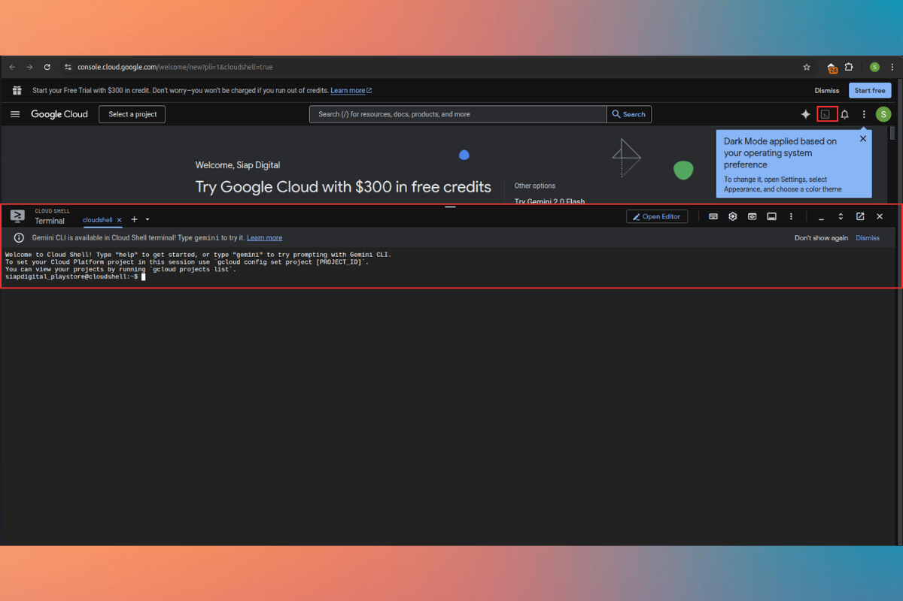
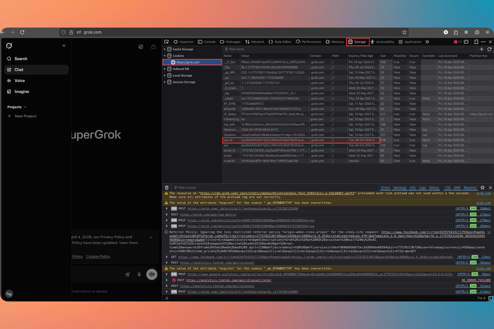
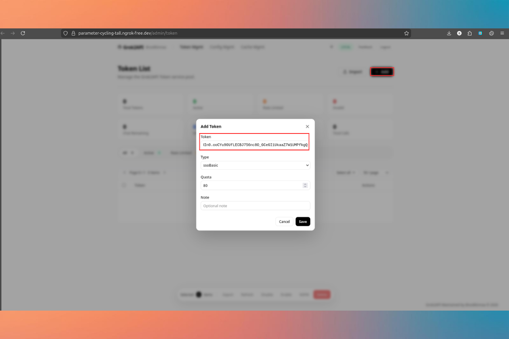
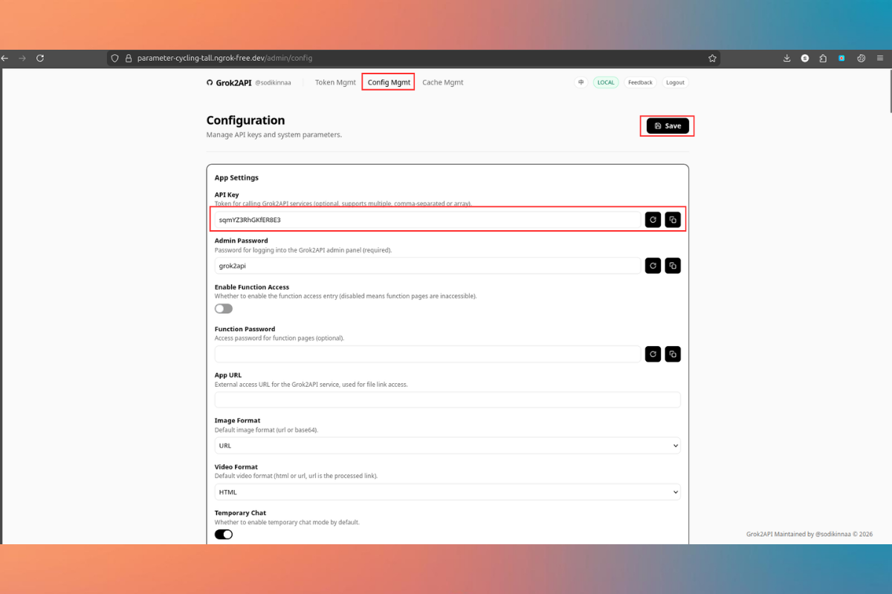
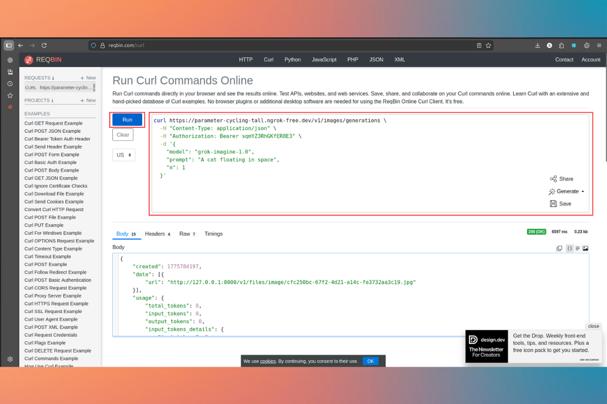

# Panduan Menjalankan grok2api

> Panduan menjalankan `grok2api` menggunakan Docker, Google Cloud Console atau VPS, lalu mempublikasikannya ke internet dengan ngrok.

Panduan ini menjelaskan cara menjalankan `grok2api` dengan bantuan Google Cloud Console atau VPS pribadi.

Proses ini memanfaatkan fitur dari Google Cloud Console:
https://console.cloud.google.com



Google Cloud Console menyediakan quota untuk mengakses terminal selama 50 jam per bulan.

Jika kamu sudah memiliki VPS, langkah-langkah di bawah juga bisa langsung diterapkan di VPS masing-masing.

## 1. Clone repository
Jalankan perintah berikut untuk mengunduh project:

```bash
git clone git@github.com:sodikinnaa/grok2api.git
```
Jika gagal bisa pilih salah satu opsi di bawah ini 

```bash
git clone https://github.com/sodikinnaa/grok2api.git
```

```bash
cd grok2api
git checkout feat/release-1.0.0
```

## 2. Jalankan service dengan Docker
Setelah masuk ke folder project, jalankan:

```bash
docker compose up -d
```

## 3. Install ngrok
Buka situs resmi ngrok untuk mendapatkan token dan informasi instalasi:

https://ngrok.com/

Kemudian instal ngrok dengan perintah berikut:

```bash
curl -sSL https://ngrok-agent.s3.amazonaws.com/ngrok.asc \
  | sudo tee /etc/apt/trusted.gpg.d/ngrok.asc >/dev/null \
  && echo "deb https://ngrok-agent.s3.amazonaws.com bookworm main" \
  | sudo tee /etc/apt/sources.list.d/ngrok.list \
  && sudo apt update \
  && sudo apt install ngrok
```

## 4. Tambahkan authtoken ngrok
Setelah mendapatkan token dari dashboard ngrok, jalankan:

```bash
ngrok config add-authtoken xxxxxx
```

Ganti `xxxxxx` dengan token milik kamu.

## 5. Publish port ke publik
Untuk membuat aplikasi bisa diakses dari internet, jalankan:

```bash
ngrok http 8000
```

Jika berhasil, ngrok akan memberikan URL publik yang bisa dibagikan.

## Catatan
- Pastikan service berjalan normal sebelum menjalankan `ngrok`.
- Jika port aplikasi bukan `8000`, sesuaikan perintah `ngrok http` dengan port yang digunakan.

## 6. Cara Setup Backend grok2api

1. Ambil cookie dari Grok seperti pada gambar berikut:


2. Paste token pada kolom yang tersedia seperti pada gambar berikut:


3. Generate bearer token untuk digunakan saat mengakses API seperti pada gambar berikut:


# 5. Cara Generate Gambar via API
Project ini difokuskan sebagai backend untuk MCP, jadi proses generate dilakukan langsung melalui API, bukan melalui GUI.

Kamu bisa menggunakan terminal lokal atau website seperti https://reqbin.com/curl untuk menguji request ke backend.

## Test Generate Image
Gunakan endpoint `/v1/images/generations` untuk membuat gambar.

```bash
curl https://parameter-cycling-tall.ngrok-free.dev/v1/images/generations \
  -H "Content-Type: application/json" \
  -H "Authorization: Bearer YOUR_BEARER_TOKEN" \
  -d '{
    "model": "grok-imagine-1.0",
    "prompt": "A cat floating in space",
    "n": 1
  }'
```

Keterangan:
- `model`: model gambar yang digunakan.
- `prompt`: deskripsi gambar yang ingin dibuat.
- `n`: jumlah gambar yang ingin dihasilkan.



## Test Generate Video
Gunakan endpoint `/v1/videos` untuk membuat video.

```bash
curl https://parameter-cycling-tall.ngrok-free.dev/v1/videos \
  -H "Content-Type: application/json" \
  -H "Authorization: Bearer YOUR_BEARER_TOKEN" \
  -d '{
    "model": "grok-imagine-1.0-video",
    "prompt": "A neon rainy street at night, cinematic slow tracking shot",
    "size": "1280x720",
    "seconds": 6,
    "quality": "standard"
  }'
```

Keterangan:
- `model`: model video yang digunakan.
- `prompt`: deskripsi video yang ingin dibuat.
- `size`: resolusi output video.
- `seconds`: durasi video dalam detik.
- `quality`: kualitas video yang dihasilkan.

Catatan penting:
- Ganti `YOUR_BEARER_TOKEN` dengan bearer token hasil generate dari dashboard/backend.
- Jika request video gagal dengan error seperti `Media post create failed, 403`, biasanya masalahnya ada pada akses akun upstream ke fitur video, bukan pada format `curl`.
- Untuk debugging, gunakan `curl -i` agar response header dan status code ikut terlihat.


## 6. Troubleshooting
Jika masih error, jalankan FlareSolverr berikut bila memang dibutuhkan oleh environment kamu:

```bash
docker run -p 8191:8191 ghcr.io/flaresolverr/flaresolverr:latest
```

Pastikan juga service backend, token, dan akses model video sudah aktif dengan benar.

